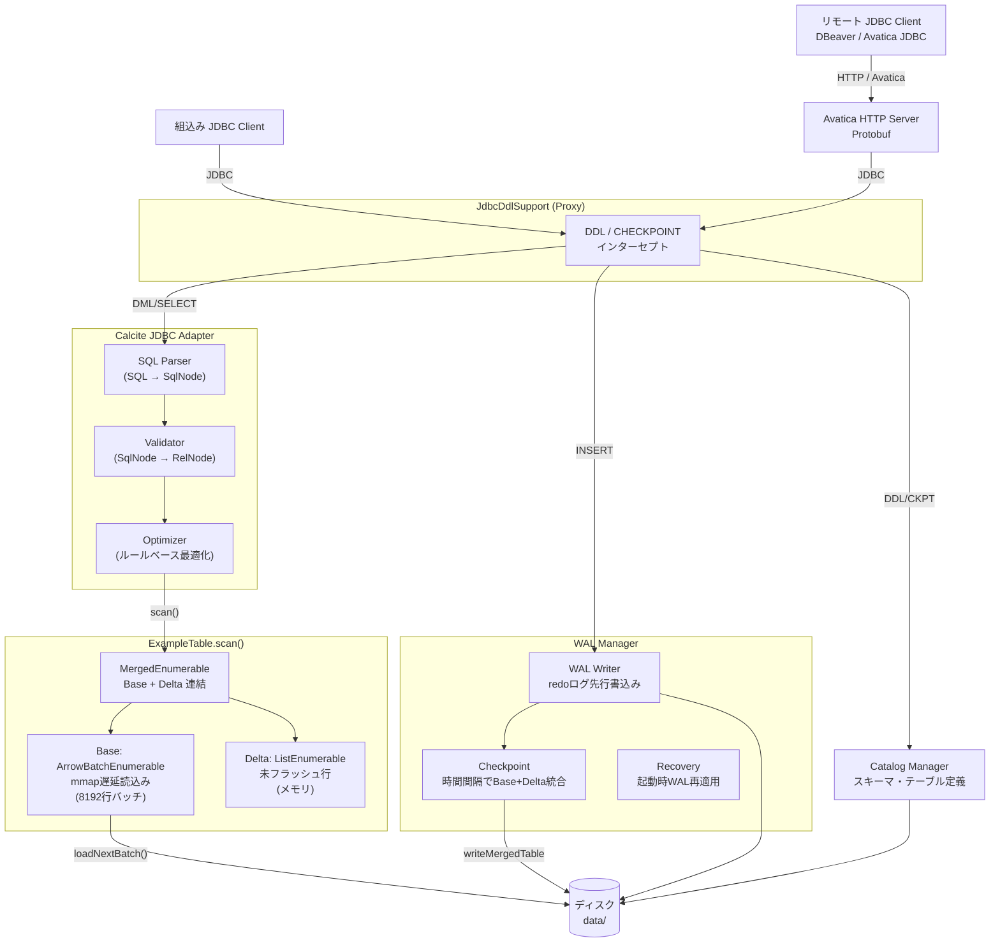
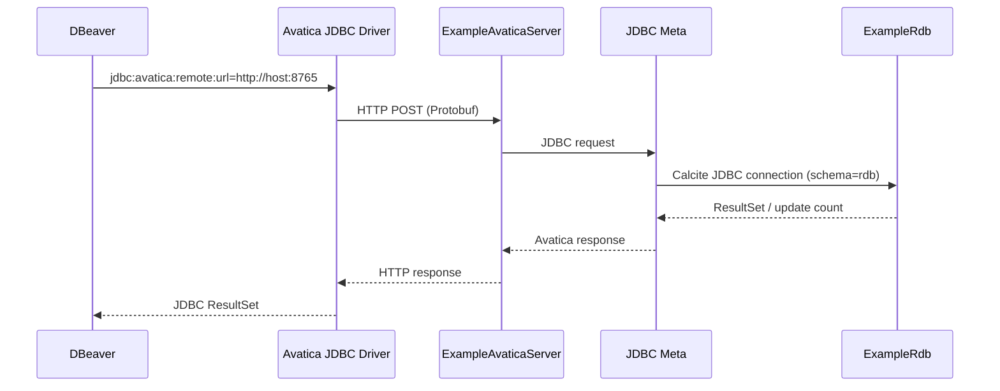
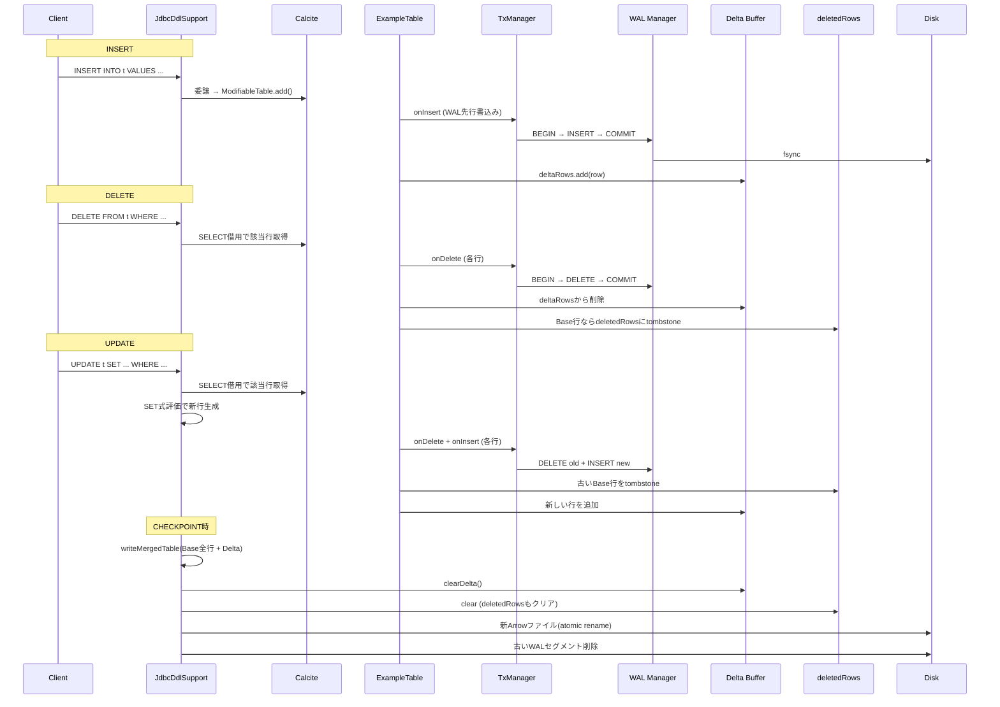
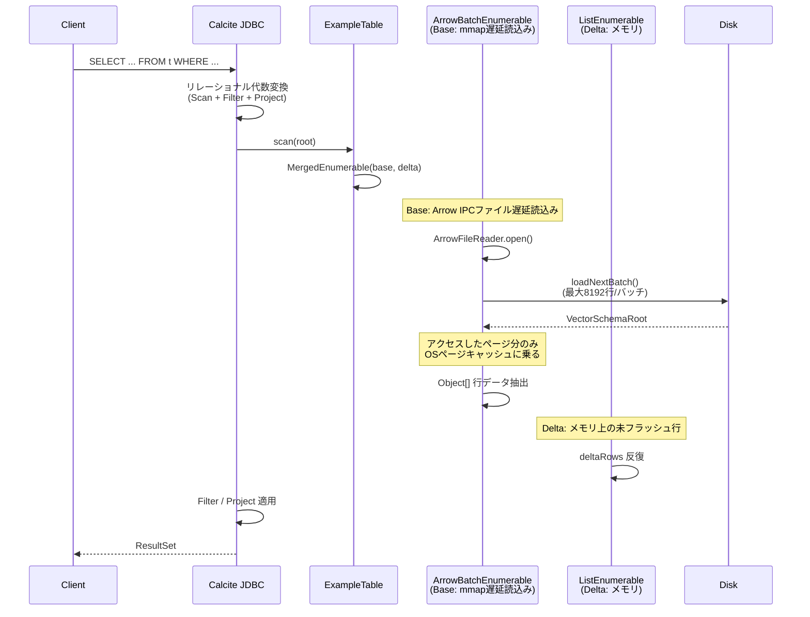
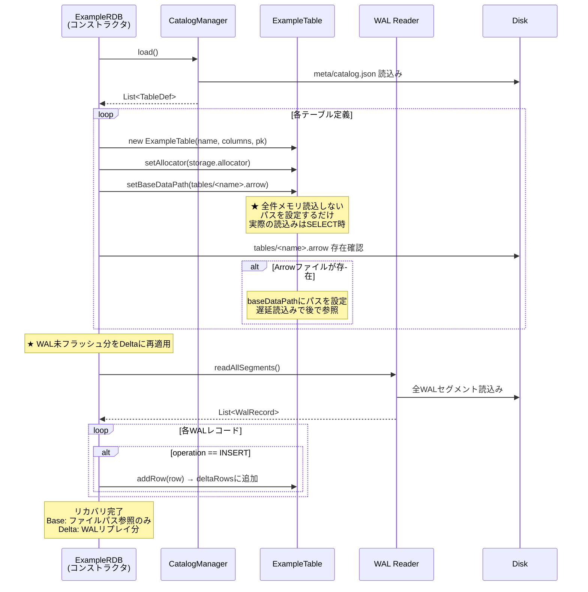
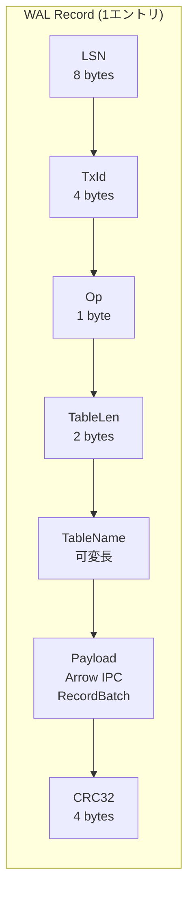
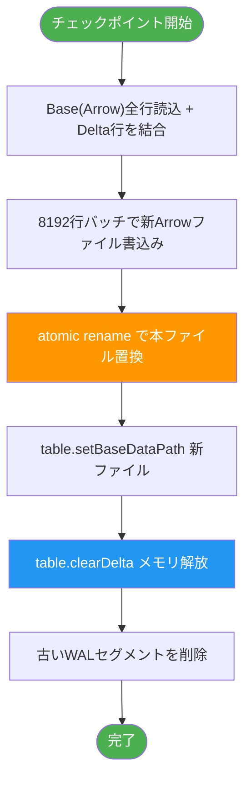

# Example RDB 設計書

Apache Calcite + Apache Arrow を用いた学習用シンプルRDBの設計。

## 1. 目標

- **学習目的**: RDBの内部構造（SQL解析・最適化・ストレージ・WAL・リカバリ）を理解する
- **実用的な構成**: 実際のRDBと同じ設計パターンを採用
- **シンプルな実装**: 複雑すぎず、各レイヤが読み解ける規模

---

## 2. 全体アーキテクチャ



---

## 3. コンポーネント一覧

| コンポーネント | 役割 | 技術 | 実装 |
|---|---|---|---|
| Calcite JDBC Adapter | JDBCインターフェース、SQL解析・最適化 | Apache Calcite + Avatica | 既存 |
| JdbcDdlSupport | DDL/CHECKPOINT/DELETE/UPDATEをCalcite到達前にインターセプト | Java動的プロキシ | 自作 |
| Schema / Table | Calcite SPI実装、Base+Deltaスキャン、DELETE/UPDATE/tombstone管理 | Calcite SPI | 自作 |
| ArrowBatchEnumerable | Arrow IPCファイルを8192行バッチでmmap遅延読込み | Apache Arrow Java | 自作 |
| MergedEnumerable | Base(Arrow) + Delta(メモリ)のEnumerable連結 | Calcite linq4j | 自作 |
| Arrow Storage Engine | Arrow IPC形式の読み書き、バッチ書込み、マージ書込み | Apache Arrow Java | 自作 |
| WAL Manager | 書込みの先行ログ化、チェックポイント、リカバリ | 独自実装 | 自作 |
| Catalog Manager | テーブル/カラム/主キー/インデックス定義の永続化 | JSON | 自作 |
| Transaction Manager | トランザクション管理（AUTOCOMMIT中心） | 独自実装 | 自作 |
| Covering Index | ソート済みArrow IPCによるCovering Index、Delta Index、tombstone | Apache Arrow Java | 自作 |
| Avatica HTTP Server | リモートJDBC要求をCalcite JDBCへ中継 | Apache Avatica Jetty | 自作 |
| Flight SQL Server | Arrow Flight SQL経由のバルクインポート（gRPC :8815） | Apache Arrow Flight | 自作 |
| ExampleRdbServer | Avatica + Flight SQL統合ランチャー | — | 自作 |
| erdb-cli | CSV/TSV読込み+全件検証+Flight SQL送信CLI | picocli + Commons CSV | 自作 |

---

## 4. データフロー

### 4.0 リモート接続フロー（Avatica）

Avaticaサーバーは単一の `ExampleRdb` インスタンスを保持し、各リモートJDBC接続へ
同一の `rdb` スキーマを公開する。データディレクトリはサーバープロセスだけが開く。



接続先は `http://<host>:8765`、シリアライゼーションは Protobuf を使用する。認証・TLSは
この初期実装の対象外であり、信頼できるネットワーク内でのみ公開する。

---

### 4.1 書込みフロー（WAL + Delta方式）

INSERT、DELETE、UPDATEすべてWAL先行書込みで保護される。



### 4.2 読込みフロー（Base + Delta マージ）



メモリに保持するのは Delta（未フラッシュ分）のみ。過去データは全てmmap経由でOSページキャッシュに任せる。

### 4.3 リカバリフロー（起動時）



---

## 5. ストレージモデル（Base + Delta）

### メモリ構造

```
ExampleTable
├── baseDataPath: Path           ← Arrow IPCファイルのパス（mmap遅延読込み）
├── deltaRows: List<Object[]>    ← 未チェックポイントのINSERT/UPDATE行
├── deletedRows: List<Object[]>  ← Baseから削除された行のtombstone
└── allocator: BufferAllocator   ← Arrowメモリアロケータ（共有）
```

### SELECT時のスキャン

```
scan()
  │
  ├── ArrowBatchEnumerable(baseDataPath)
  │     ArrowFileReader.loadNextBatch() で8192行ずつ読込
  │     FilteredEnumerator が deletedRows に該当する行をスキップ
  │     アクセスしたページのみOSページキャッシュに乗る
  │
  └── ListEnumerable(deltaRows)
        Delta の行をメモリから返す

→ MergedEnumerable で両者を連結
```

### Arrow IPCファイルのバッチ構成

```
┌──────────────────┐
│ Magic (ARROW1)   │
│ Schema           │
├──────────────────┤
│ RecordBatch 0    │  ← 最大8192行
│ RecordBatch 1    │  ← 最大8192行
│ ...              │
│ RecordBatch N    │
├──────────────────┤
│ Footer           │
│ Magic (ARROW1)   │
└──────────────────┘
```

### メモリ使用量

| 要素 | サイズ | 解放タイミング |
|------|--------|--------------|
| Base (mmapページ) | アクセスしたページ分のみ | OSがLRUで自動追い出し |
| Delta (未フラッシュ行) | チェックポイント間隔分のINSERT/UPDATE行 | チェックポイント時にクリア |
| deletedRows (tombstone) | 削除されたBase行の数 | チェックポイント時にクリア |
| Arrow Readerオブジェクト | 数KB（テーブル単位） | Enumerator.close() 時 |

---

## 6. WALレコード構成



| フィールド | サイズ | 説明 |
|---|---|---|
| LSN | 8 bytes | Log Sequence Number（単調増加） |
| TxId | 4 bytes | トランザクションID |
| Op | 1 byte | `BEGIN(0)` `INSERT(1)` `UPDATE(2)` `DELETE(3)` `COMMIT(4)` `ABORT(5)` |
| TableLen | 2 bytes | テーブル名のバイト長 |
| TableName | 可変長 | 対象テーブル名（UTF-8） |
| Payload | 可変長 | 行データ。Arrow IPC RecordBatchシリアライズ |
| CRC32 | 4 bytes | レコード全体の整合性チェック |

実装ではJSON Lines形式（1行1レコード）を使用し、可読性を確保している。

---

## 7. チェックポイント方式

時間間隔トリガー（デフォルト30秒）で実行。



---

## 8. ディスクレイアウト

```
data/
├── meta/
│   └── catalog.json              ← カタログ（テーブル/スキーマ定義）
├── tables/
│   ├── users.arrow               ← Arrow IPC ファイル（テーブル毎）
│   └── orders.arrow
└── wal/
    ├── wal_000001.log            ← WALセグメント
    ├── wal_000002.log
    └── checkpoint.meta           ← 最終チェックポイント情報
```

---

## 9. ディレクトリ構成（プロジェクト）

```
example-rdb/
├── pom.xml
├── docs/
│   ├── DESIGN.md                         ← 本設計書
│   ├── SEQUENCE.md                       ← クエリ経路シーケンス図
│   ├── WAL_MMAP_DESIGN.md                ← WAL+mmap方式設計書
│   ├── COVERING_INDEX_DESIGN.md          ← セカンダリインデックス設計書
│   └── BULK_IMPORT.md                    ← バルクインポート設計書
├── src/main/java/com/example/rdb/
│   ├── ExampleRdb.java                   ← エントリポイント
│   │
│   ├── jdbc/
│   │   └── JdbcDdlSupport.java           ← DDL/DML/CHECKPOINT/SELECT プロキシ
│   │
│   ├── schema/
│   │   ├── ExampleSchema.java            ← Calcite Schema 実装
│   │   ├── ExampleTable.java             ← Calcite Table (Base+Delta+Index スキャン)
│   │   ├── ListEnumerable.java           ← List → Enumerable 変換
│   │   ├── MergedEnumerable.java         ← Base+Delta 連結
│   │   └── CatalogManager.java           ← カタログ管理（インデックス定義含む）
│   │
│   ├── index/
│   │   ├── IndexDefinition.java          ← インデックス定義
│   │   ├── IndexKey.java                 ← 比較可能キー
│   │   ├── CoveringEntry.java            ← rowId+キー値+INCLUDE値
│   │   ├── CoveringDeltaIndex.java       ← Delta Index (TreeMap+tombstone)
│   │   ├── CoveringIndexFile.java        ← Arrow IPC インデックスファイル
│   │   └── IndexManager.java             ← テーブル単位のインデックス管理
│   │
│   ├── storage/
│   │   ├── ArrowStorage.java             ← Arrow IPC 読み書き (8192行バッチ)
│   │   ├── ArrowBatchEnumerable.java     ← mmap遅延読込み Enumerable
│   │   └── ArrowSchemaConverter.java     ← Arrow ⇔ RelDataType 変換
│   │
│   ├── wal/
│   │   ├── WalManager.java               ← WAL統合管理
│   │   ├── WalWriter.java                ← WAL書込み
│   │   ├── WalReader.java                ← WAL読込み
│   │   ├── WalRecord.java                ← レコード定義
│   │   ├── WalOperation.java             ← 操作種別
│   │   └── CheckpointManager.java        ← チェックポイント管理
│   │
│   ├── engine/
│   │   └── TransactionManager.java       ← トランザクション管理
│   │
│   └── remote/
│       ├── ExampleRdbServer.java         ← 統合ランチャー (Avatica + Flight)
│       ├── ExampleAvaticaServer.java     ← Avatica HTTP サーバー
│       ├── ExampleJdbcMeta.java          ← Avatica メタデータアダプタ
│       ├── ExampleFlightSqlServer.java   ← Flight SQL サーバー
│       └── ErdbFlightSqlProducer.java    ← FlightSqlProducer (Bulk Ingest)
│
├── cli/src/main/java/com/example/rdb/cli/
│   ├── ErdbCli.java                      ← CLIエントリポイント (picocli)
│   └── ImportCommand.java                ← importサブコマンド
│
├── src/test/java/com/example/rdb/        ← テスト (144件)
│   ├── support/                          ← 組込みクライアントテスト
│   ├── testclient/                       ← JDBCクライアントテスト
│   ├── storage/                          ← Arrowストレージテスト
│   ├── wal/                              ← WALテスト
│   ├── remote/                           ← リモートサーバーテスト
│   ├── SecondaryIndexTest.java           ← セカンダリインデックステスト
│   ├── TransactionAtomicityTest.java     ← トランザクション原子性テスト
│   ├── OptimisticLockTest.java           ← 楽観ロックテスト
│   ├── UpdateDeleteTest.java             ← UPDATE/DELETEテスト
│   ├── MmapPersistenceTest.java          ← mmap永続化テスト
│   └── PersistenceRecoveryTest.java      ← 永続化・リカバリテスト
│
├── loadtest/                             ← k6負荷テスト環境
│   ├── Dockerfile                        ← k6ビルド (xk6-sql + avatica)
│   ├── docker-compose.yml
│   └── scripts/                          ← シナリオ1〜7
│
└── data/                                 ← 実行時に生成（gitignore対象）
    ├── tables/                           ← Arrow IPCファイル
    ├── indexes/                          ← ソート済みインデックスファイル
    ├── imports/                          ← バルクインポートstaging
    ├── meta/                             ← catalog.json
    └── wal/                              ← WALセグメント
```

---

## 10. 技術スタック

| 項目 | 選択 | バージョン |
|---|---|---|
| 言語 | Java | 17 |
| ビルド | Maven | 3.9+ |
| SQLエンジン | Apache Calcite | 1.37.0 |
| JDBCプロトコル | Apache Avatica | 1.23.0 |
| 列指向フォーマット | Apache Arrow Java | 19.0.0 |
| バルク転送 | Arrow Flight SQL | 19.0.0 |
| Protobuf | Google Protobuf | 4.33.4 |
| CLIフレームワーク | picocli | 4.7.6 |
| CSVパーサー | Apache Commons CSV | 1.11.0 |
| テスト | JUnit 5 | 5.10.2 |
| アサーション | AssertJ | 3.25.3 |

---

## 11. トランザクション設計

現段階では **AUTOCOMMIT中心**。各INSERT/UPDATE/DELETEは自動的にBEGIN→操作→COMMITのWALレコードとして記録される。

リカバリ時はコミット済みトランザクション（COMMITレコードが存在するTxId）のみ適用され、未コミット・ABORTされたトランザクションは破棄される（原子性担保）。

アプリケーション層の楽観的ロックパターンにも対応:
```sql
UPDATE t SET col=val, txn_id=txn_id+1 WHERE id=X AND txn_id=<読み込み時の値>
```
影響行数0件で競合を検出。

```mermaid
state diagram-v2
    [*] --> Idle

    Idle --> Active: SQL受信 (AUTOCOMMIT)
    Active --> Writing: WAL先行書込み
    Writing --> Applying: Delta Buffer に追加
    Applying --> Committing: COMMIT
    Committing --> Flushed: COMMIT レコード追記
    Flushed --> Idle: レスポンス返却

    note right of Flushed
        チェックポイントは非同期
        （時間間隔で別スレッド実行）
    end note
```

---

## 12. 実装フェーズ

```mermaid
graph LR
    P1["Phase 1<br/>インメモリ読出し<br/>Calcite + Schema/Table"]
    P2["Phase 2<br/>WAL書込み<br/>WAL Manager + Tx"]
    P3["Phase 3<br/>Arrow永続化<br/>ArrowStorage + Checkpoint"]
    P4["Phase 4<br/>リカバリ<br/>起動時WAL再適用"]
    P5["Phase 5<br/>mmap方式<br/>Base+Delta遅延読込み"]
    P6["Phase 6<br/>UPDATE/DELETE<br/>tombstone + WAL対応"]
    P7["Phase 7<br/>Covering Index<br/>Arrow sorted index"]
    P8["Phase 8<br/>Arrow 19 + Flight SQL<br/>バルクインポート"]
    P9["Phase 9<br/>Tx原子性 + 楽観ロック<br/>CopyOnWriteArrayList"]

    P1 --> P2 --> P3 --> P4 --> P5 --> P6 --> P7 --> P8 --> P9

    style P1 fill:#2196F3,color:#fff
    style P2 fill:#4CAF50,color:#fff
    style P3 fill:#FF9800,color:#fff
    style P4 fill:#9C27B0,color:#fff
    style P5 fill:#F44336,color:#fff
    style P6 fill:#795548,color:#fff
    style P7 fill:#009688,color:#fff
    style P8 fill:#E91E63,color:#fff
    style P9 fill:#3F51B5,color:#fff
```



| Phase | 内容 | 完了条件 |
|---|---|---|
| **1** | Calcite接続、Schema/Table実装、インメモリでSELECT | JDBC経由でSELECTが実行できる |
| **2** | WAL Manager実装、INSERTのWAL書込み | データ更新がWALに記録される |
| **3** | Arrow Storage + Checkpoint実装 | データがArrow IPCファイルに永続化される |
| **4** | リカバリ実装 | 再起動後にデータが復元される |
| **5** | mmap方式移行（Base+Delta） | 全データをメモリに保持せず、Arrowファイル遅延読込みで動作 |
| **6** | UPDATE/DELETE対応 | DELETE（tombstone方式）、UPDATE（DELETE+INSERT）、WAL/リカバリ対応 |
| **7** | セカンダリインデックス（Covering Index） | CREATE INDEX/DROP INDEX、等価・範囲検索、DML連携、永続化 |
| **8** | Arrow 19アップグレード + Flight SQL バルクインポート | erdb-cli経由でCSVデータをFlight SQLで一括取込 |
| **9** | トランザクション原子性 + 並行安全性 + 楽観ロック | CopyOnWriteArrayList化、コミット済みTxのみリカバリ、version列ロック |
