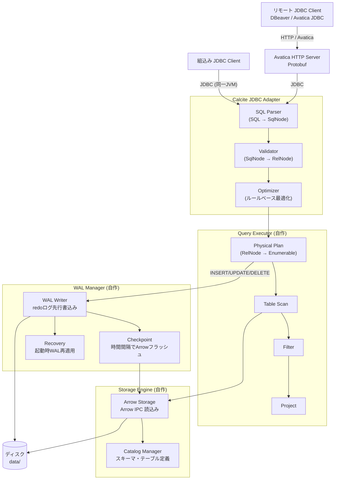
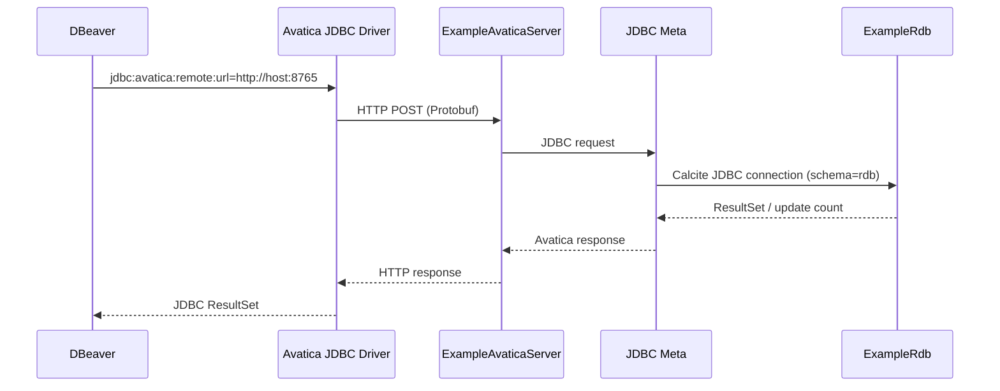
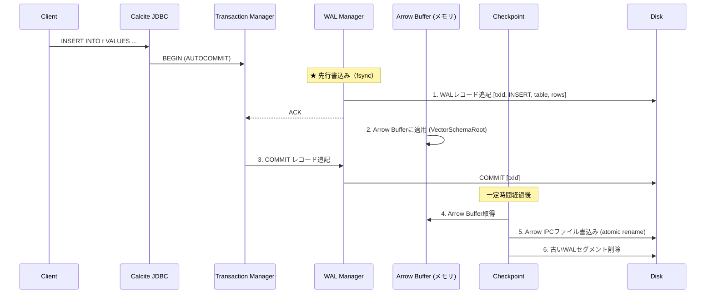
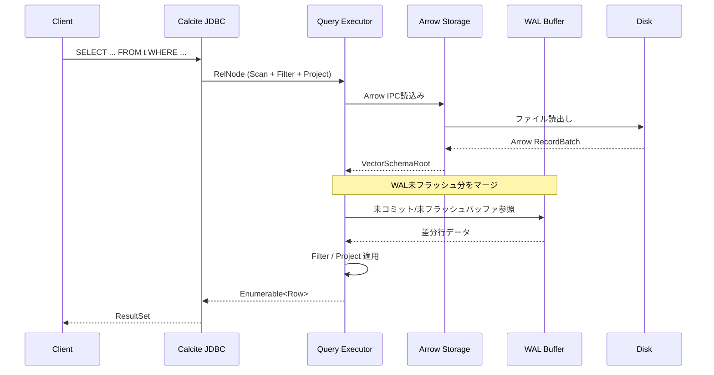
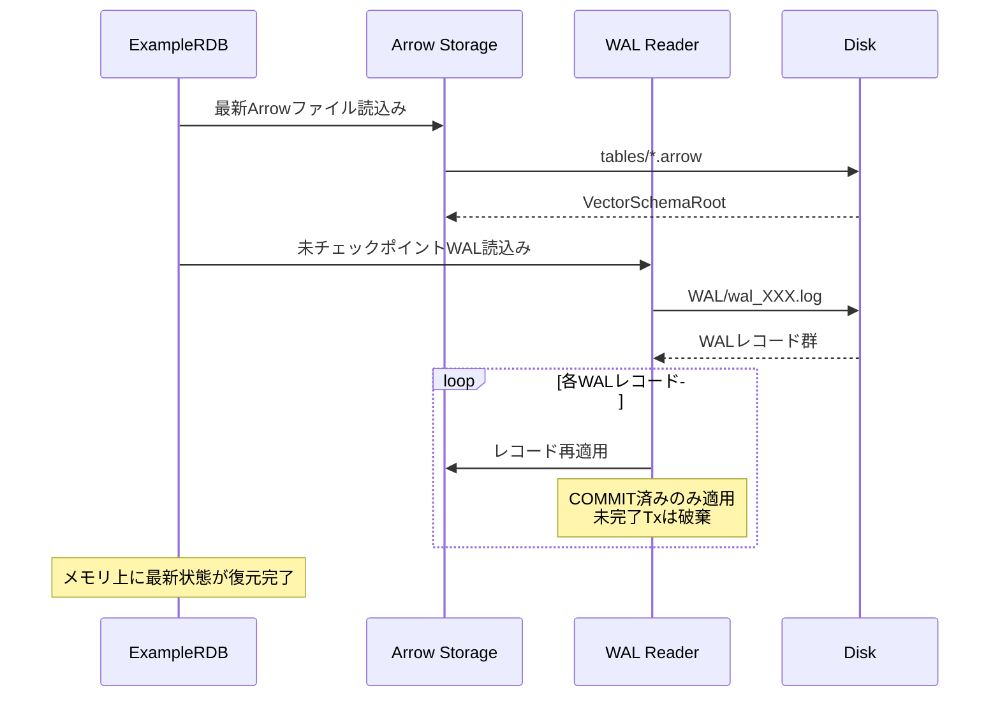
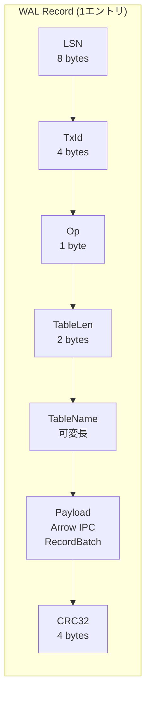
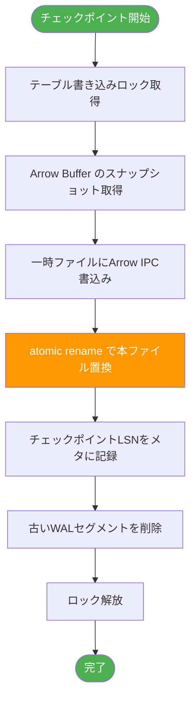
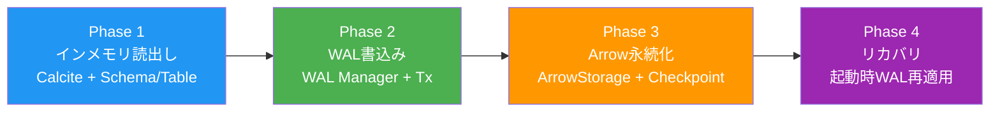

# Example RDB 設計書

Apache Calcite + Apache Arrow を用いた学習用シンプルRDBの設計。

## 1. 目標

- **学習目的**: RDBの内部構造（SQL解析・最適化・ストレージ・WAL・リカバリ）を理解する
- **実用的な構成**: 実際のRDBと同じ設計パターンを採用
- **シンプルな実装**: 複雑すぎず、各レイヤが読み解ける規模

---

## 2. 全体アーキテクチャ



---

## 3. コンポーネント一覧

| コンポーネント | 役割 | 技術 | 実装 |
|---|---|---|---|
| Calcite JDBC Adapter | JDBCインターフェース、SQL解析・最適化 | Apache Calcite + Avatica | 既存 |
| Schema / Table | CalciteのSPI実装、メタデータ提供 | Calcite SPI | 自作 |
| Query Executor | RelNode → 物理実行、読み取り処理 | Calcite Enumerable | 自作 |
| Arrow Storage Engine | Arrow IPC形式の読み書き | Apache Arrow Java | 自作 |
| WAL Manager | 書込みの先行ログ化、チェックポイント、リカバリ | 独自実装 | 自作 |
| Catalog Manager | テーブル/カラム定義の永続化 | JSON | 自作 |
| Transaction Manager | トランザクション管理（AUTOCOMMIT中心） | 独自実装 | 自作 |
| Avatica HTTP Server | リモートJDBC要求をCalcite JDBCへ中継 | Apache Avatica Jetty | 自作 |

---

## 4. データフロー

### 4.0 リモート接続フロー（Avatica）

Avaticaサーバーは単一の `ExampleRdb` インスタンスを保持し、各リモートJDBC接続へ
同一の `rdb` スキーマを公開する。データディレクトリはサーバープロセスだけが開く。



接続先は `http://<host>:8765`、シリアライゼーションは Protobuf を使用する。認証・TLSは
この初期実装の対象外であり、信頼できるネットワーク内でのみ公開する。

---

### 4.1 書込みフロー（WAL方式）



### 4.2 読込みフロー



### 4.3 リカバリフロー（起動時）



---

## 5. WALレコード構成



| フィールド | サイズ | 説明 |
|---|---|---|
| LSN | 8 bytes | Log Sequence Number（単調増加） |
| TxId | 4 bytes | トランザクションID |
| Op | 1 byte | `BEGIN(0)` `INSERT(1)` `UPDATE(2)` `DELETE(3)` `COMMIT(4)` `ABORT(5)` |
| TableLen | 2 bytes | テーブル名のバイト長 |
| TableName | 可変長 | 対象テーブル名（UTF-8） |
| Payload | 可変長 | 行データ。Arrow IPC RecordBatchシリアライズ |
| CRC32 | 4 bytes | レコード全体の整合性チェック |

---

## 6. チェックポイント方式

時間間隔トリガー（デフォルト30秒）で実行。



---

## 7. ディスクレイアウト

```
data/
├── meta/
│   └── catalog.json              ← カタログ（テーブル/スキーマ定義）
├── tables/
│   ├── users.arrow               ← Arrow IPC ファイル（テーブル毎）
│   └── orders.arrow
└── wal/
    ├── wal_000001.log            ← WALセグメント
    ├── wal_000002.log
    └── checkpoint.meta           ← 最終チェックポイント情報
```

---

## 8. ディレクトリ構成（プロジェクト）

```
example-rdb/
├── pom.xml
├── docs/
│   └── DESIGN.md
├── src/main/java/com/example/rdb/
│   ├── ExampleRdb.java                  ← エントリポイント
│   │
│   ├── jdbc/
│   │   ├── ExampleDriver.java           ← JDBCドライバ登録
│   │   └── ExampleJdbcFactory.java      ← Calcite JDBC Factory
│   │
│   ├── schema/
│   │   ├── ExampleSchema.java           ← Calcite Schema 実装
│   │   ├── ExampleTable.java            ← Calcite Table 実装
│   │   └── CatalogManager.java          ← カタログ管理
│   │
│   ├── storage/
│   │   ├── ArrowStorage.java            ← Arrow IPC 読み書き
│   │   └── ArrowSchemaConverter.java    ← Arrow ⇔ RelDataType 変換
│   │
│   ├── wal/
│   │   ├── WalManager.java              ← WAL統合管理
│   │   ├── WalWriter.java               ← WAL書込み
│   │   ├── WalReader.java               ← WAL読込み
│   │   ├── WalRecord.java               ← レコード定義
│   │   └── CheckpointManager.java       ← チェックポイント管理
│   │
│   ├── engine/
│   │   ├── QueryExecutor.java           ← 実行エンジン
│   │   └── TransactionManager.java      ← トランザクション管理
│   │
│   └── util/
│       └── FileUtils.java
│
├── src/test/java/com/example/rdb/
│   ├── jdbc/
│   ├── storage/
│   ├── wal/
│   └── engine/
│
└── data/                                ← 実行時に生成（gitignore対象）
```

---

## 9. 技術スタック

| 項目 | 選択 | バージョン(目安) |
|---|---|---|
| 言語 | Java | 17 |
| ビルド | Maven | 3.9+ |
| SQLエンジン | Apache Calcite | 1.37.x |
| JDBCプロトコル | Apache Avatica | 1.23.x |
| 列指向フォーマット | Apache Arrow Java | 15.x |
| テスト | JUnit 5 | 5.10.x |

---

## 10. トランザクション設計

現段階では **AUTOCOMMIT中心**。将来的な明示的トランザクション拡張も見据えた設計。

```mermaid
state diagram-v2
    [*] --> Idle

    Idle --> Active: SQL受信 (AUTOCOMMIT)
    Active --> Writing: WAL先行書込み
    Writing --> Applying: Arrow Buffer適用
    Applying --> Committing: COMMIT
    Committing --> Flushed: COMMIT レコード追記
    Flushed --> Idle: レスポンス返却

    note right of Flushed
        チェックポイントは非同期
        （時間間隔で別スレッド実行）
    end note
```

---

## 11. 実装フェーズ



| Phase | 内容 | 完了条件 |
|---|---|---|
| **1** | Calcite接続、Schema/Table実装、インメモリでSELECT | JDBC経由でSELECTが実行できる |
| **2** | WAL Manager実装、INSERT/UPDATE/DELETEのWAL書込み | データ更新がWALに記録される |
| **3** | Arrow Storage + Checkpoint実装 | データがArrow IPCファイルに永続化される |
| **4** | リカバリ実装 | 再起動後にデータが復元される |
