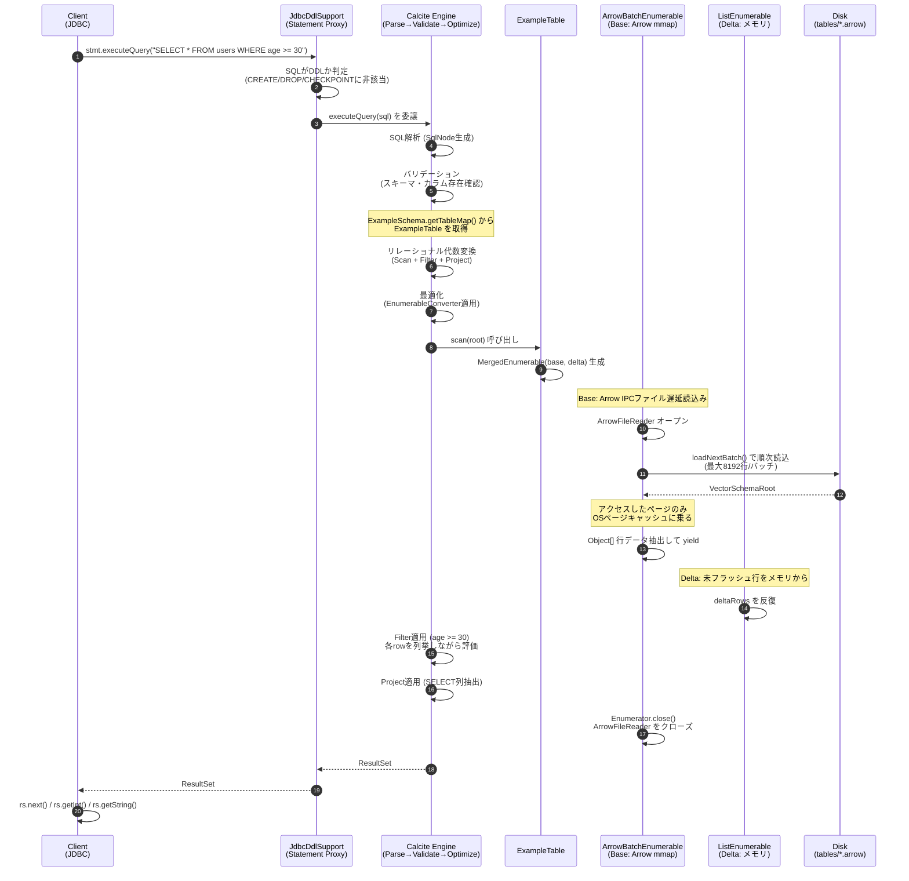
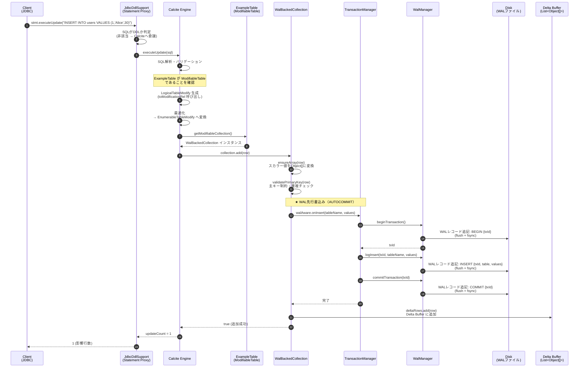
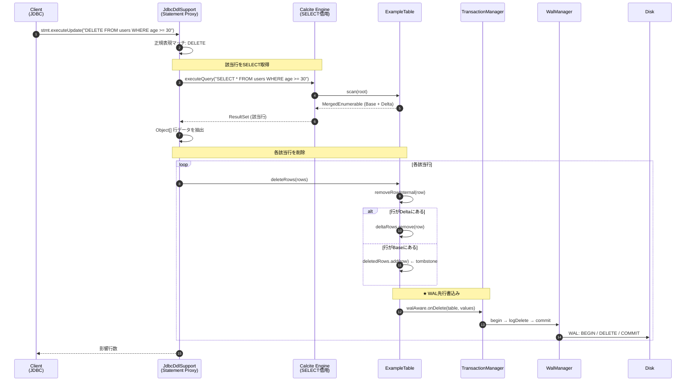
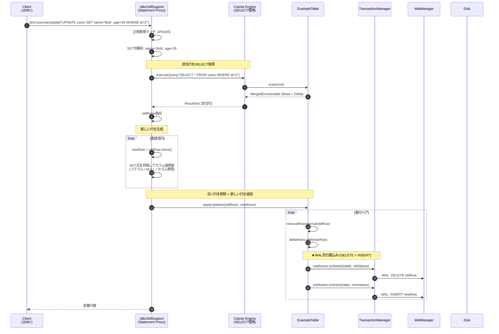
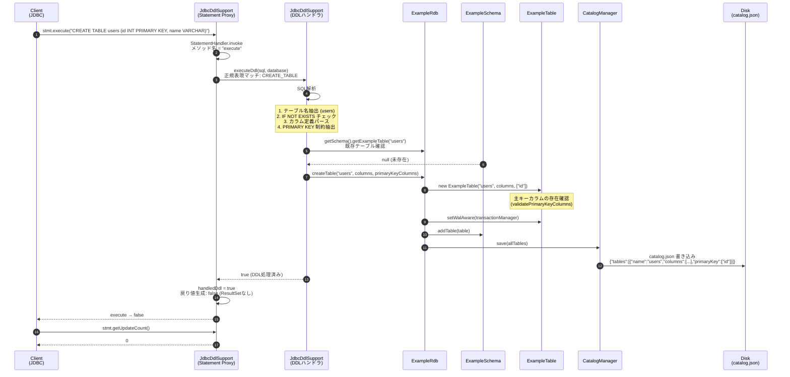
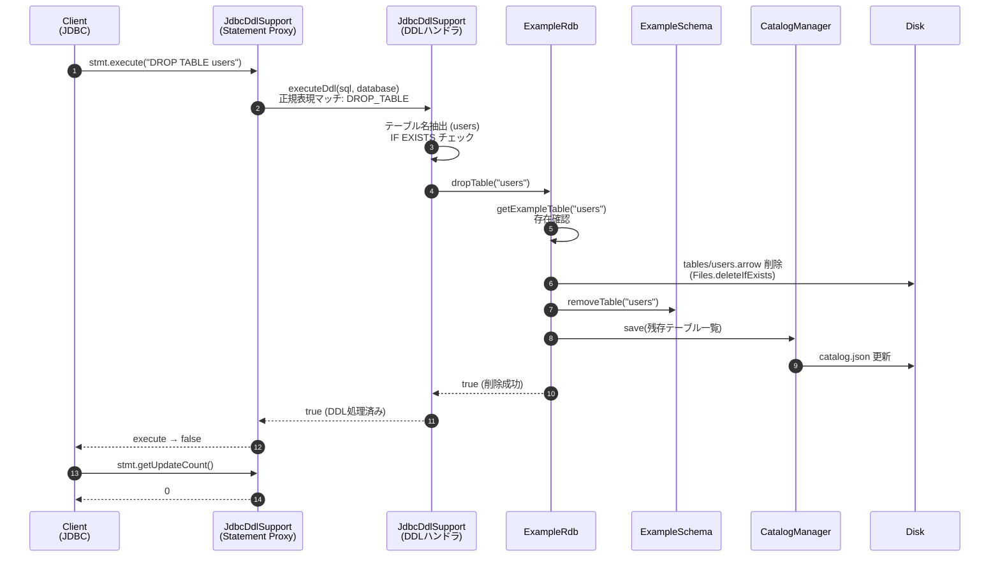
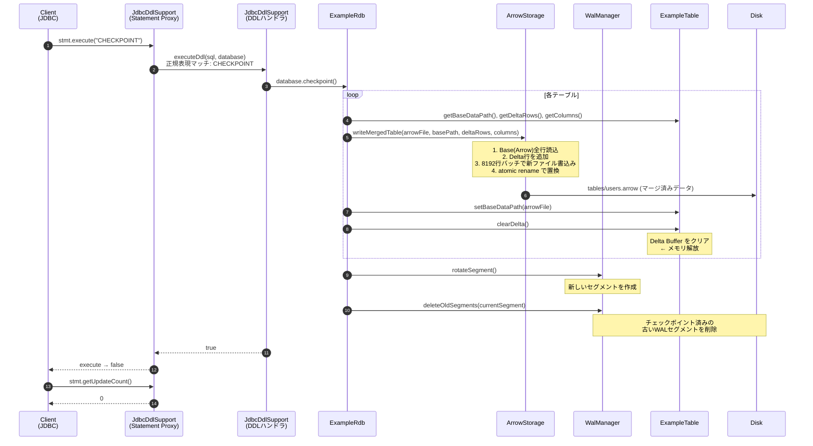
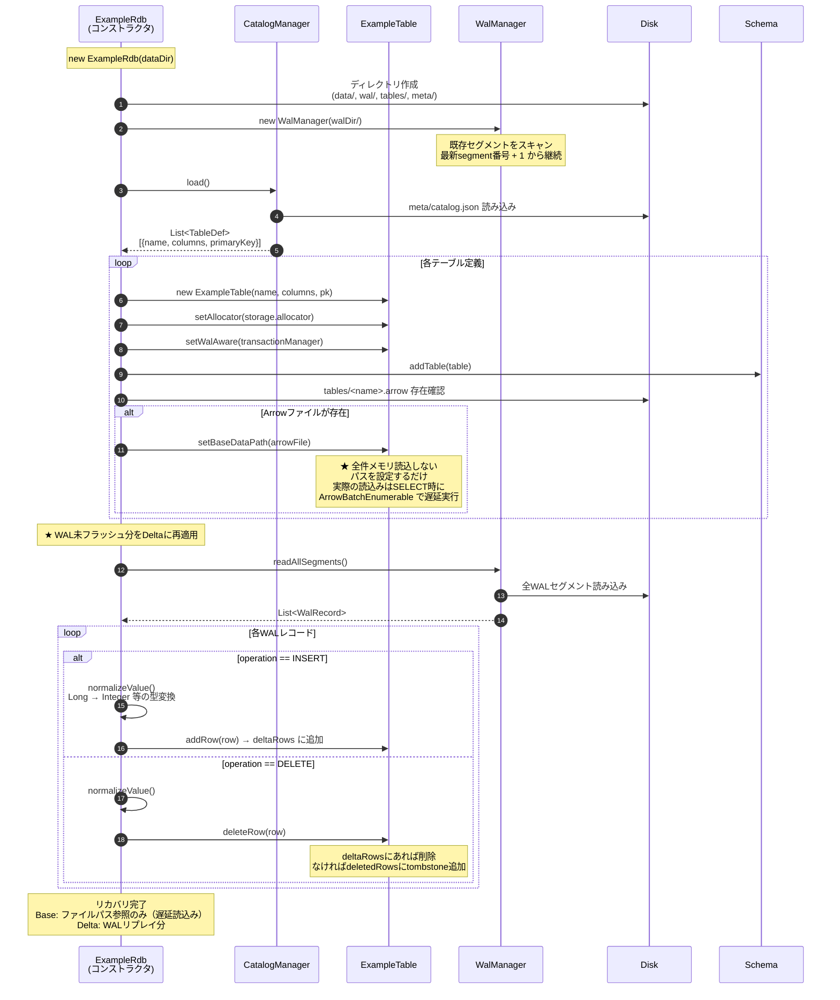
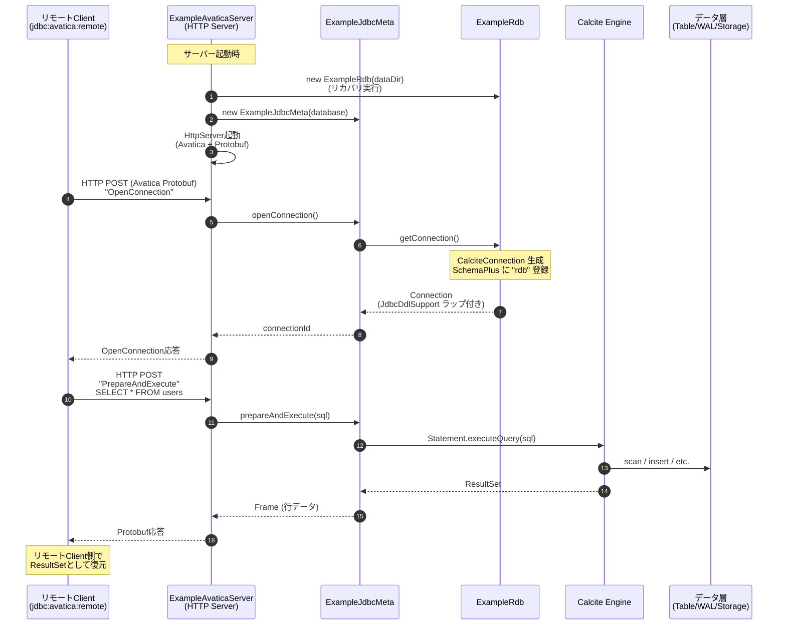

# JDBC クエリ経路シーケンス図

JDBC経由で発行されたSQLがどのような経路をたどってデータに到達するかを、DML・DDLごとにMermaidシーケンス図で示す。

## 関連クラスの役割

| クラス | パッケージ | 役割 |
|--------|-----------|------|
| `JdbcDdlSupport` | `jdbc` | JDBC Connection/Statementを動的プロキシでラップ。DDL/CHECKPOINT/DELETE/UPDATE/SELECT(Index)をCalcite到達前にインターセプトする |
| `ExampleRdb` | (root) | エントリポイント。Schema/WAL/Storage/Catalog/Indexを統合し、接続・リカバリ・チェックポイント・インデックス管理を提供 |
| `ExampleSchema` | `schema` | Calcite Schema実装。テーブル名→ExampleTableのマッピングを管理 |
| `ExampleTable` | `schema` | Calcite ScannableTable + ModifiableTable実装。Base(Arrow mmap)+Delta(メモリ)のマージスキャン。deletedRowsによるBase行のフィルタリング。Covering Index連携。WAL連携Collection内蔵 |
| `ArrowBatchEnumerable` | `storage` | Arrow IPCファイルを8192行バッチ単位でmmap遅延読込みするCalcite Enumerable |
| `MergedEnumerable` | `schema` | Base(ArrowBatchEnumerable) + Delta(ListEnumerable)の2つのEnumerableを連結 |
| `IndexManager` | `index` | テーブル単位のセカンダリインデックス管理。Covering Index Scan、DML連携 |
| `CoveringDeltaIndex` | `index` | Delta Index (TreeMap + tombstone + prefix lookup) |
| `CoveringIndexFile` | `index` | Arrow IPC形式のソート済みインデックスファイル読み書き |
| `TransactionManager` | `engine` | AUTOCOMMITのWAL先行書込みを実行 |
| `WalManager` | `wal` | WALセグメントの読み書き・ローテーション。コミット済みTx追跡 |
| `ArrowStorage` | `storage` | Arrow IPCファイルの読み書き（8192行バッチ、マージ書込み） |
| `CatalogManager` | `schema` | テーブル定義（カラム・主キー・インデックス）をJSON永続化 |
| `CheckpointManager` | `wal` | 時間間隔でのチェックポイント実行 |
| `ExampleRdbServer` | `remote` | 統合ランチャー（Avatica :8765 + Flight SQL :8815） |
| `ExampleAvaticaServer` | `remote` | Avatica HTTPプロトコルでリモートJDBC接続を提供 |
| `ExampleJdbcMeta` | `remote` | Avaticaメタデータアダプタ。共有ExampleRdbからConnection生成 |
| `ExampleFlightSqlServer` | `remote` | Arrow Flight SQL gRPCサーバー（バルクインポート用） |
| `ErdbFlightSqlProducer` | `remote` | NoOpFlightSqlProducer継承。acceptPutStatementBulkIngest実装 |
| `ErdbCli` | `cli` | CLIエントリポイント（picocli）。importサブコマンド提供 |

---

## 1. SELECT（参照クエリ）



### ポイント
- **Base は mmap 遅延読込み**。Arrow IPCファイルから8192行バッチ単位で読み込む。アクセスしたページのみ物理メモリを消費
- **Delta はメモリ上の未フラッシュ行**。チェックポイント後にクリアされるため、サイズは有限
- WHERE / ORDER BY / JOIN / GROUP BY等はCalciteのEnumerable実行エンジンが処理（遅延読込みの恩恵を受ける）
- DDLでないSQLはプロキシを素通りしてCalciteへ

---

## 2. INSERT（データ挿入）



### ポイント
- **WAL書込みがDelta追加より先**（先行ログ）。WALのfsync後にDelta更新
- INSERTはDelta Buffer（メモリ）にのみ追加。Base（Arrowファイル）には触れない
- 各INSERTに対し AUTOCOMMIT で BEGIN→INSERT→COMMIT の3レコードがWALに書かれる
- 主キー制約は `WalBackedCollection.add()` 内で検証される（Delta内のみ）
- 単一カラムテーブルの場合、Calciteがスカラー値を渡す可能性があるため `ensureArray()` で変換

---

## 3. DELETE（データ削除）



### ポイント
- **CalciteのSELECTを借用して該当行を特定**。WHERE条件の評価はCalciteに任せる
- Delta行は `deltaRows` から直接削除。Base行は `deletedRows` にtombstoneとして記録
- SELECT時に `FilteredEnumerator` が `deletedRows` をスキップするため、削除されたBase行は結果に現れない
- 各DELETE行に対しWALに DELETE レコードを書き込む（AUTOCOMMIT）

---

## 4. UPDATE（データ更新）



### ポイント
- UPDATEは **DELETE + INSERT の組み合わせ**として実装。WALにも両方のレコードが書かれる
- SET式は リテラル値（`'Bob'`, `26`, `NULL`, `TRUE`）とカラム参照（`name = other_col`）に対応
- 算術式（`age = age + 1`）は未対応
- 古い行がBaseにある場合は `deletedRows` にtombstone追加、新しい行は `deltaRows` に追加

---

## 5. CREATE TABLE（DDL）



### ポイント
- **Calciteは関与しない**。DDLはJdbcDdlSupportプロキシが正規表現でインターセプト
- テーブル定義は `CatalogManager` 経由で `catalog.json` に永続化
- カラム型は `INT → INTEGER`, `VARCHAR → VARCHAR` 等にマッピング
- `IF NOT EXISTS` が付いていれば既存テーブルを無視（エラーにしない）

---

## 6. DROP TABLE（DDL）



### ポイント
- Arrowデータファイル（`.arrow`）も同時に削除
- `IF EXISTS` が無く、テーブルが存在しない場合は `SQLException` をスロー

---

## 7. CHECKPOINT



### ポイント
- **Base + Delta をマージして新Arrowファイル書込み**。従来の「全メモリデータをフラッシュ」から変更
- チェックポイント後にDelta Bufferをクリア → メモリ解放
- Base pathを新ファイルに更新。次回SELECTは新ファイルから遅延読込み
- WALセグメントをローテートし、古いセグメントを削除
- 自動チェックポイントの場合は `CheckpointManager` がスケジューラスレッドから同じ処理を実行

---

## 8. リカバリ（起動時）



### ポイント
- **復元順序**: catalog.json → Base path設定 → WAL再適用
- 従来方式はArrowファイルを全件メモリに読み込んでいたが、**mmap方式ではパスを設定するだけ**で全件読込を回避
- Arrowファイルは直近のチェックポイント時点のスナップショット。SELECT時に `ArrowBatchEnumerable` が8192行バッチで遅延読込み
- WALはチェックポイント後に追加された差分のみ残存する（古いセグメントは削除済み）
- WALの数値はJSON経由で `Long` になるため、カラム型に応じて `normalizeValue()` で `Integer` 等に変換

---

## 9. Avaticaリモートサーバー経由の接続



### ポイント
- リモート接続ではAvatica HTTPプロトコル（Protobufシリアライズ）を使用
- `ExampleJdbcMeta` が共有 `ExampleRdb` から接続を生成するため、全リモートクライアントが同一データベースインスタンスにアクセス
- DDL、DELETE、UPDATEも `JdbcDdlSupport` ラップ経由で機能する
- 複数クライアントからの同時アクセスは `CopyOnWriteArrayList` と `synchronized` で並行安全性を確保
- アプリケーション層の楽観的ロックパターン（version列 + WHERE条件）に対応

---

## 経路まとめ

```
SQL文の種類ごとの経路:

SELECT  ──► JdbcDdlSupport(プロキシ) ──► Calcite ──► ExampleTable.scan()
                                                    ├── ArrowBatchEnumerable (Base: mmap遅延読込み)
                                                    │   └── FilteredEnumerator (deletedRowsをスキップ)
                                                    └── ListEnumerable (Delta: メモリ)
                                                    └── MergedEnumerable で連結
SELECT(Index) ──► JdbcDdlSupport(プロキシ) ──► IndexManager.scanCovering() / scanRange()
                                                    ├── CoveringDeltaIndex (Delta: TreeMap)
                                                    └── CoveringIndexFile (Base: Arrow sorted)
INSERT  ──► JdbcDdlSupport(プロキシ) ──► Calcite ──► ModifiableTable.add() ──► WAL書込み ──► deltaRows + Index更新
DELETE  ──► JdbcDdlSupport(プロキシ) ──► Calcite(SELECT借用) ──► 該当行取得
              ──► table.deleteRows() ──► WAL DELETE書込み ──► deltaRows削除 / deletedRows追加 / Index更新
UPDATE  ──► JdbcDdlSupport(プロキシ) ──► Calcite(SELECT借用) ──► 該当行取得
              ──► SET式評価 ──► table.applyUpdates(old,new)
              ──► WAL DELETE+INSERT書込み ──► deletedRows + deltaRows + Index更新
CREATE  ──► JdbcDdlSupport(プロキシ) ──► ExampleRdb.createTable() ──► CatalogManager ──► catalog.json
DROP    ──► JdbcDdlSupport(プロキシ) ──► ExampleRdb.dropTable() ──► CatalogManager ──► catalog.json
CREATE IDX ──► JdbcDdlSupport(プロキシ) ──► ExampleRdb.createIndex() ──► IndexManager + catalog.json
CKPT    ──► JdbcDdlSupport(プロキシ) ──► writeMergedTable(Base+Delta) ──► clearDelta ──► Index再構築 ──► WAL削除
RECOVER ──► ExampleRdb(コンストラクタ) ──► Catalog読込 ──► setBaseDataPath ──► WAL→Delta/Deleted再適用(コミット済Txのみ)
BULK    ──► Flight SQL gRPC ──► ErdbFlightSqlProducer ──► acceptPutStatementBulkIngest ──► table.addRow() × N
REMOTE  ──► Avatica HTTP ──► ExampleJdbcMeta ──► ExampleRdb.getConnection() ──► (上記いずれか)
```
